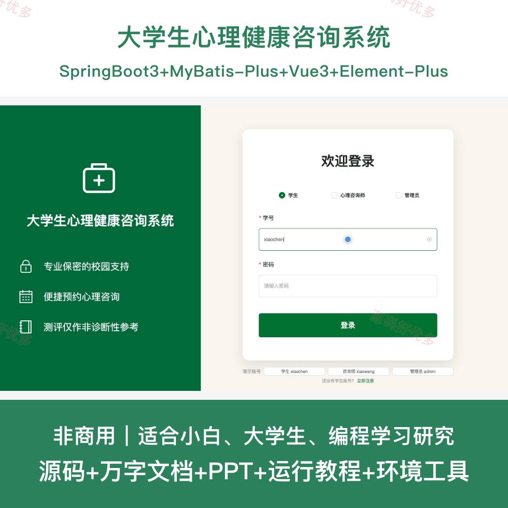
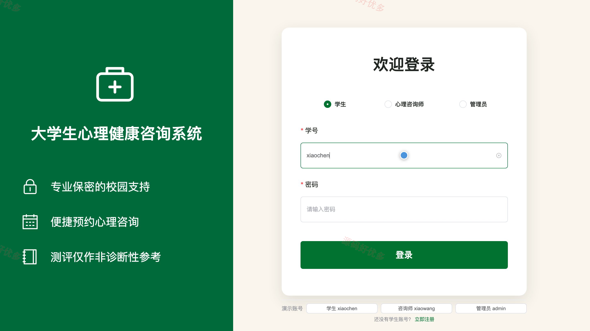
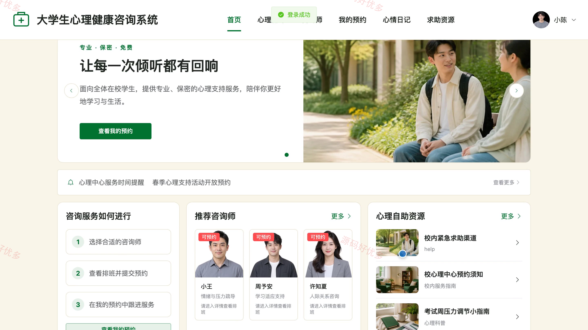
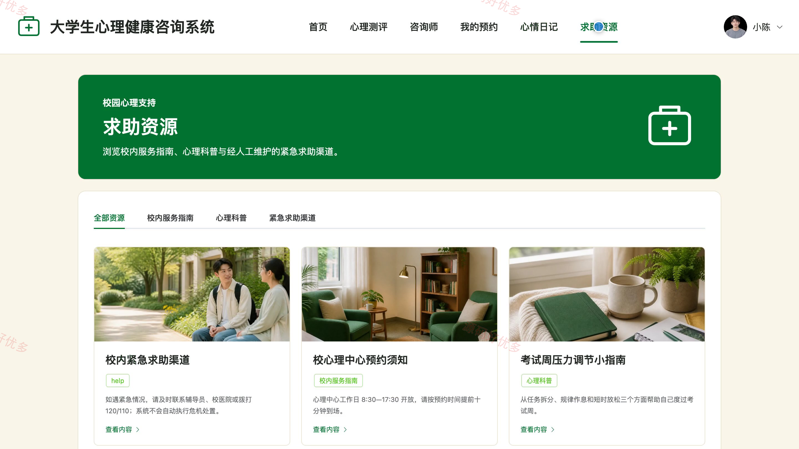
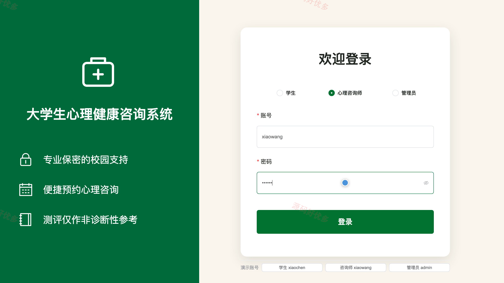
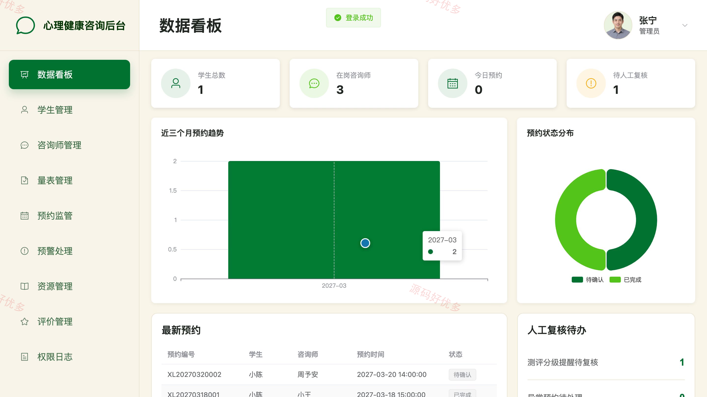
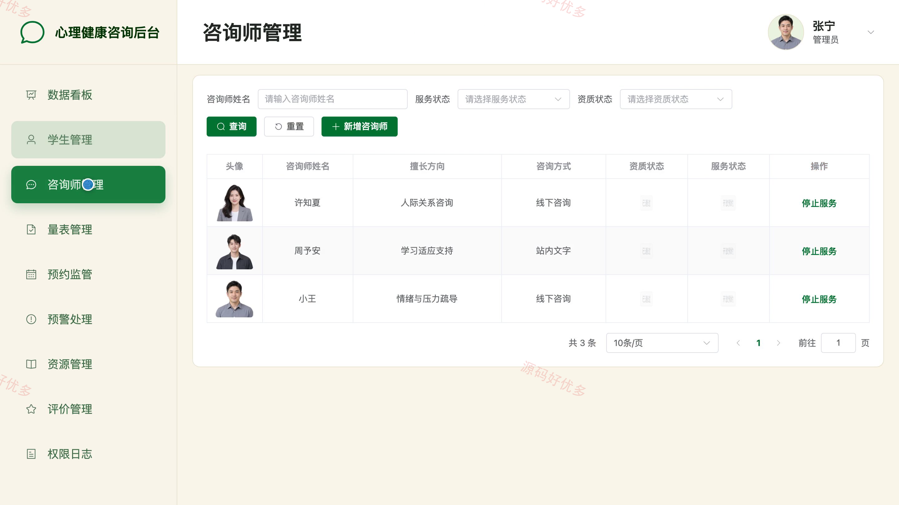
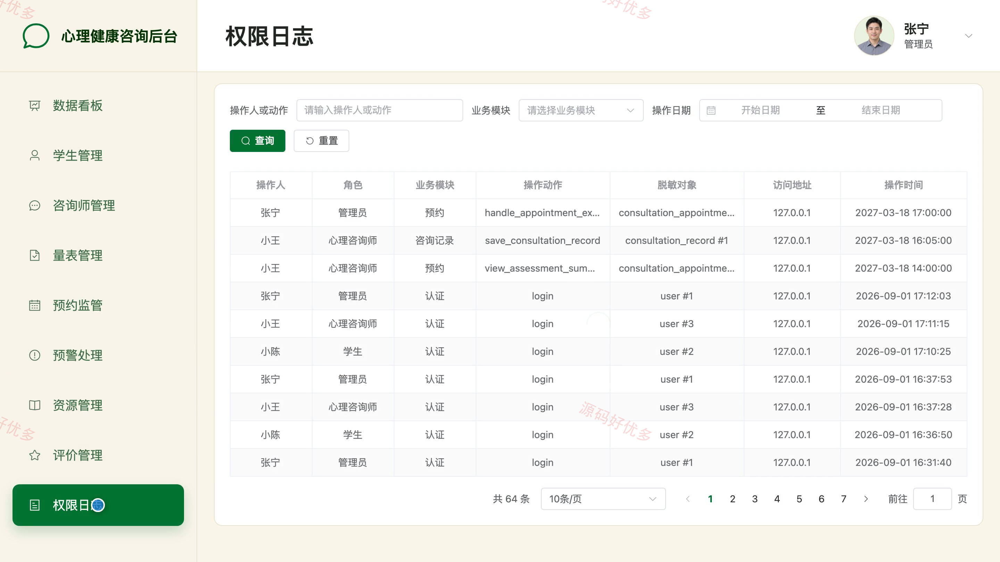

# bs110A
bs110A大学生心理健康咨询系统
## 源码问题查看主页咨询

### 一、关键词
心理咨询、心理测评、咨询预约、情绪疏导、校园心理服务

### 二、作品包含
源码+数据库+万字设计文档+PPT+全套环境和工具资源+本地部署教程

### 三、项目技术
前端技术： Html、Css、Js、Vue3.4、Element-Plus
后端技术：Java、SpringBoot3.2.0、MyBatis-Plus

### 四、运行环境（以下版本亲测，其他版本兼容性请自行测试）
开发工具：IDEA/eclipse + VSCODE

数据库：MySQL5.7+（共21张表）

数据库管理工具：Navicat10以上版本

环境配置软件： JDK17 + Maven3.6

前端Nodejs：16

浏览器：谷歌浏览器

### 五、项目介绍
项目编号：bs110A

本系统面向高校学生心理支持场景，围绕非诊断性心理测评、心理咨询师筛选、咨询预约、站内交流、心情日记、咨询记录、随访管理、资源服务和人工预警复核形成完整业务闭环。学生可完成测评、预约咨询并跟踪服务进度，心理咨询师可管理排班、处理预约和登记咨询随访，管理员负责账号、量表、资源、预警、评价及匿名统计管理。

角色：学生、心理咨询师、管理员

学生功能：个人资料与密码维护、心理测评与结果查看、咨询师筛选与时段查询、咨询预约与进度管理、预约内站内咨询交流、私密心情日记管理、咨询评价与匿名意见、校内求助资源与心理科普浏览。

心理咨询师功能：专业资料维护、咨询排班管理、学生预约处理、咨询工作台与站内交流、咨询记录与保密备注、学生测评摘要授权查看、咨询随访计划与完成登记、心理科普投稿与服务评价查看。

管理员功能：学生账号与状态管理、咨询师资质与服务状态管理、心理量表与计分规则管理、预约监管与异常投诉处理、预警人工复核与跟进登记、科普资源与求助公告管理、服务评价与反馈处理、匿名统计与权限日志。

### 六、运行截图

